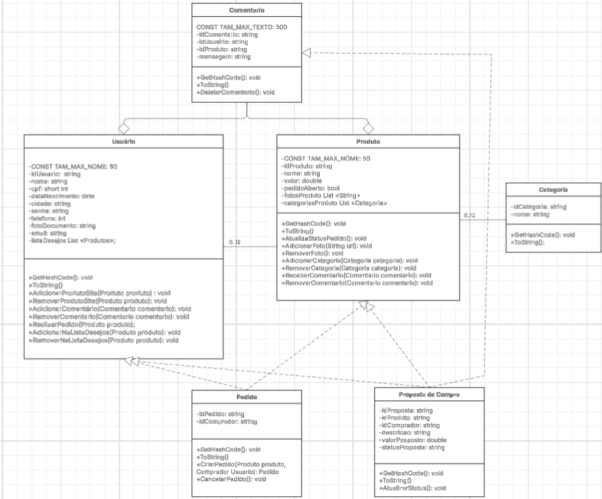
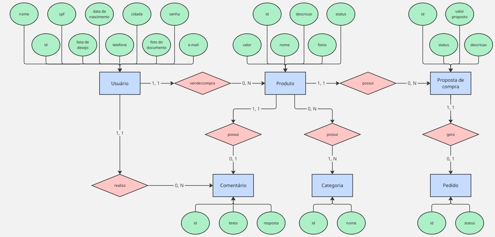
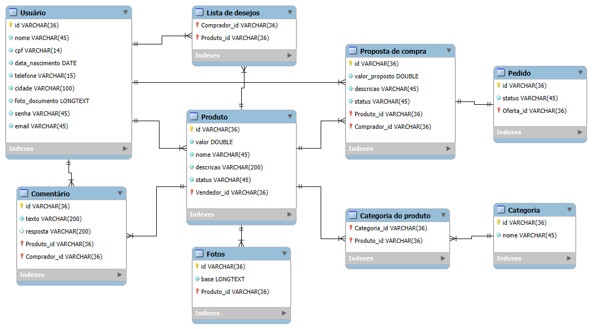

## 4. Projeto da Solução

Pré-requisitos: <a href="03-Modelagem do Processo de Negocio.md"> Modelagem do Processo de Negocio</a>

## 4.1. Arquitetura da solução

O usuário acessará a página web, desenvolvida em HTML, CSS e JavaScript, por meio do navegador. A página armazenará as informações do usuário no Local Storage e utilizará a internet para realizar requisições que dependem do login salvo. O sistema será hospedado no GitHub Pages.
 
 **diagrama**:
 
 
 

### 4.2. Protótipos de telas

Visão geral da interação do usuário pelas telas do sistema e protótipo interativo das telas com as funcionalidades que fazem parte do sistema (wireframes).
Apresente as principais interfaces da plataforma. Discuta como ela foi elaborada de forma a atender os requisitos funcionais, não funcionais e histórias de usuário abordados nas <a href="02-Especificação do Projeto.md"> Especificação do Projeto</a>.
A partir das atividades de usuário identificadas na seção anterior, elabore o protótipo de tela de cada uma delas.
#### Cadastro 1:

#### Cadastro 2:

#### Cadastro 3:

#### Login:

#### Home:

#### Menu Lateral:

#### Produto:

#### Perfil:

#### Oferta Comprador:

#### Oferta Vendedor:

## Diagrama de Classes

## Modelo ER

O Modelo ER representa através de um diagrama como as entidades (coisas, objetos) se relacionam entre si na aplicação interativa.]

As referências abaixo irão auxiliá-lo na geração do artefato “Modelo ER”.

> - [Como fazer um diagrama entidade relacionamento | Lucidchart](https://www.lucidchart.com/pages/pt/como-fazer-um-diagrama-entidade-relacionamento)

### 4.3. Modelo de dados

O desenvolvimento da solução proposta requer a existência de bases de dados que permitam efetuar os cadastros de dados e controles associados aos processos identificados, assim como recuperações.
Utilizando a notação do DER (Diagrama Entidade e Relacionamento), elaborem um modelo, na ferramenta visual indicada na disciplina, que contemple todas as entidades e atributos associados às atividades dos processos identificados. Deve ser gerado um único DER que suporte todos os processos escolhidos, visando, assim, uma base de dados integrada. O modelo deve contemplar, também, o controle de acesso de usuários (partes interessadas dos processos) de acordo com os papéis definidos nos modelos do processo de negócio.
_Apresente o modelo de dados por meio de um modelo relacional que contemple todos os conceitos e atributos apresentados na modelagem dos processos._

#### 4.3.1 Modelo ER

#### 4.3.2 Esquema Relacional

---

#### 4.3.3 Modelo Físico

<code>

-- MySQL Script generated by MySQL Workbench
-- Fri May  2 14:56:22 2025
-- Model: New Model    Version: 1.0
-- MySQL Workbench Forward Engineering

SET @OLD_UNIQUE_CHECKS=@@UNIQUE_CHECKS, UNIQUE_CHECKS=0;
SET @OLD_FOREIGN_KEY_CHECKS=@@FOREIGN_KEY_CHECKS, FOREIGN_KEY_CHECKS=0;
SET @OLD_SQL_MODE=@@SQL_MODE, SQL_MODE='ONLY_FULL_GROUP_BY,STRICT_TRANS_TABLES,NO_ZERO_IN_DATE,NO_ZERO_DATE,ERROR_FOR_DIVISION_BY_ZERO,NO_ENGINE_SUBSTITUTION';

-- Schema mydb

-- Schema mydb

CREATE SCHEMA IF NOT EXISTS `mydb` DEFAULT CHARACTER SET utf8 ;
USE `mydb` ;

-- Table `mydb`.`Usuário`

CREATE TABLE IF NOT EXISTS `mydb`.`Usuário` (
  `id` VARCHAR(36) NOT NULL,
  `nome` VARCHAR(45) NOT NULL,
  `cpf` VARCHAR(14) NOT NULL,
  `data_nascimento` DATE NOT NULL,
  `telefone` VARCHAR(15) NOT NULL,
  `cidade` VARCHAR(100) NOT NULL,
  `foto_documento` LONGTEXT NOT NULL,
  `senha` VARCHAR(45) NOT NULL,
  `email` VARCHAR(45) NOT NULL,
  PRIMARY KEY (`id`),
  UNIQUE INDEX `id_UNIQUE` (`id` ASC) VISIBLE,
  UNIQUE INDEX `cpf_UNIQUE` (`cpf` ASC) VISIBLE)
ENGINE = InnoDB;

-- Table `mydb`.`Produto`

CREATE TABLE IF NOT EXISTS `mydb`.`Produto` (
  `id` VARCHAR(36) NOT NULL,
  `valor` DOUBLE NOT NULL,
  `nome` VARCHAR(45) NOT NULL,
  `descricao` VARCHAR(200) NOT NULL,
  `status` VARCHAR(45) NOT NULL,
  `Vendedor_id` VARCHAR(36) NOT NULL,
  PRIMARY KEY (`id`, `Vendedor_id`),
  UNIQUE INDEX `id_UNIQUE` (`id` ASC) VISIBLE,
  INDEX `fk_Produto_Usuário1_idx` (`Vendedor_id` ASC) VISIBLE,
  CONSTRAINT `fk_Produto_Usuário1`
    FOREIGN KEY (`Vendedor_id`)
    REFERENCES `mydb`.`Usuário` (`id`)
    ON DELETE NO ACTION
    ON UPDATE NO ACTION)
ENGINE = InnoDB;

-- Table `mydb`.`Oferta`

CREATE TABLE IF NOT EXISTS `mydb`.`Oferta` (
  `id` VARCHAR(36) NOT NULL,
  `valor_proposto` DOUBLE NOT NULL,
  `comentario` VARCHAR(45) NOT NULL,
  `status` VARCHAR(45) NOT NULL,
  `Produto_id` VARCHAR(36) NOT NULL,
  `Comprador_id` VARCHAR(36) NOT NULL,
  PRIMARY KEY (`id`, `Produto_id`, `Comprador_id`),
  UNIQUE INDEX `id_UNIQUE` (`id` ASC) VISIBLE,
  INDEX `fk_Oferta_Produto1_idx` (`Produto_id` ASC) VISIBLE,
  INDEX `fk_Oferta_Usuário1_idx` (`Comprador_id` ASC) VISIBLE,
  CONSTRAINT `fk_Oferta_Produto1`
    FOREIGN KEY (`Produto_id`)
    REFERENCES `mydb`.`Produto` (`id`)
    ON DELETE NO ACTION
    ON UPDATE NO ACTION,
  CONSTRAINT `fk_Oferta_Usuário1`
    FOREIGN KEY (`Comprador_id`)
    REFERENCES `mydb`.`Usuário` (`id`)
    ON DELETE NO ACTION
    ON UPDATE NO ACTION)
ENGINE = InnoDB;

-- Table `mydb`.`Pedido`

CREATE TABLE IF NOT EXISTS `mydb`.`Pedido` (
  `id` VARCHAR(36) NOT NULL,
  `status` VARCHAR(45) NOT NULL,
  `Oferta_id` VARCHAR(36) NOT NULL,
  PRIMARY KEY (`id`, `Oferta_id`),
  UNIQUE INDEX `id_UNIQUE` (`id` ASC) VISIBLE,
  INDEX `fk_Pedido_Oferta1_idx` (`Oferta_id` ASC) VISIBLE,
  CONSTRAINT `fk_Pedido_Oferta1`
    FOREIGN KEY (`Oferta_id`)
    REFERENCES `mydb`.`Oferta` (`id`)
    ON DELETE NO ACTION
    ON UPDATE NO ACTION)
ENGINE = InnoDB;

-- Table `mydb`.`Comentário`

CREATE TABLE IF NOT EXISTS `mydb`.`Comentário` (
  `id` VARCHAR(36) NOT NULL,
  `texto` VARCHAR(200) NOT NULL,
  `resposta` VARCHAR(200) NULL,
  `Produto_id` VARCHAR(36) NOT NULL,
  `Comprador_id` VARCHAR(36) NOT NULL,
  PRIMARY KEY (`id`, `Produto_id`, `Comprador_id`),
  UNIQUE INDEX `id_UNIQUE` (`id` ASC) VISIBLE,
  INDEX `fk_Comentário_Produto_idx` (`Produto_id` ASC) VISIBLE,
  INDEX `fk_Comentário_Usuário1_idx` (`Comprador_id` ASC) VISIBLE,
  CONSTRAINT `fk_Comentário_Produto`
    FOREIGN KEY (`Produto_id`)
    REFERENCES `mydb`.`Produto` (`id`)
    ON DELETE NO ACTION
    ON UPDATE NO ACTION,
  CONSTRAINT `fk_Comentário_Usuário1`
    FOREIGN KEY (`Comprador_id`)
    REFERENCES `mydb`.`Usuário` (`id`)
    ON DELETE NO ACTION
    ON UPDATE NO ACTION)
ENGINE = InnoDB;

-- Table `mydb`.`Lista de desejos`

CREATE TABLE IF NOT EXISTS `mydb`.`Lista de desejos` (
  `Comprador_id` VARCHAR(36) NOT NULL,
  `Produto_id` VARCHAR(36) NOT NULL,
  PRIMARY KEY (`Comprador_id`, `Produto_id`),
  INDEX `fk_Usuário_has_Produto_Produto1_idx` (`Produto_id` ASC) VISIBLE,
  INDEX `fk_Usuário_has_Produto_Usuário1_idx` (`Comprador_id` ASC) VISIBLE,
  CONSTRAINT `fk_Usuário_has_Produto_Usuário1`
    FOREIGN KEY (`Comprador_id`)
    REFERENCES `mydb`.`Usuário` (`id`)
    ON DELETE NO ACTION
    ON UPDATE NO ACTION,
  CONSTRAINT `fk_Usuário_has_Produto_Produto1`
    FOREIGN KEY (`Produto_id`)
    REFERENCES `mydb`.`Produto` (`id`)
    ON DELETE NO ACTION
    ON UPDATE NO ACTION)
ENGINE = InnoDB;

-- Table `mydb`.`Fotos`

CREATE TABLE IF NOT EXISTS `mydb`.`Fotos` (
  `id` VARCHAR(36) NOT NULL,
  `base` LONGTEXT NOT NULL,
  `Produto_id` VARCHAR(36) NOT NULL,
  PRIMARY KEY (`id`, `Produto_id`),
  UNIQUE INDEX `id_UNIQUE` (`id` ASC) VISIBLE,
  CONSTRAINT `fk_Fotos_Produto1`
    FOREIGN KEY (`Produto_id`)
    REFERENCES `mydb`.`Produto` (`id`)
    ON DELETE NO ACTION
    ON UPDATE NO ACTION)
ENGINE = InnoDB;

-- Table `mydb`.`Categoria`

CREATE TABLE IF NOT EXISTS `mydb`.`Categoria` (
  `id` VARCHAR(36) NOT NULL,
  `nome` VARCHAR(45) NOT NULL,
  PRIMARY KEY (`id`),
  UNIQUE INDEX `id_UNIQUE` (`id` ASC) VISIBLE)
ENGINE = InnoDB;

-- Table `mydb`.`Categoria do produto`

CREATE TABLE IF NOT EXISTS `mydb`.`Categoria do produto` (
  `Categoria_id` VARCHAR(36) NOT NULL,
  `Produto_id` VARCHAR(36) NOT NULL,
  PRIMARY KEY (`Categoria_id`, `Produto_id`),
  INDEX `fk_Categoria_has_Produto_Produto1_idx` (`Produto_id` ASC) VISIBLE,
  INDEX `fk_Categoria_has_Produto_Categoria1_idx` (`Categoria_id` ASC) VISIBLE,
  CONSTRAINT `fk_Categoria_has_Produto_Categoria1`
    FOREIGN KEY (`Categoria_id`)
    REFERENCES `mydb`.`Categoria` (`id`)
    ON DELETE NO ACTION
    ON UPDATE NO ACTION,
  CONSTRAINT `fk_Categoria_has_Produto_Produto1`
    FOREIGN KEY (`Produto_id`)
    REFERENCES `mydb`.`Produto` (`id`)
    ON DELETE NO ACTION
    ON UPDATE NO ACTION)
ENGINE = InnoDB;

SET SQL_MODE=@OLD_SQL_MODE;
SET FOREIGN_KEY_CHECKS=@OLD_FOREIGN_KEY_CHECKS;
SET UNIQUE_CHECKS=@OLD_UNIQUE_CHECKS;

</code>

### 4.4. Tecnologias

O sistema é composto por um front-end desenvolvido com **HTML**, **CSS** e **JavaScript**, um back-end construído em **C#**, e um banco de dados implementado com o SGBD **MySQL**. Ele está hospedado utilizando a ferramenta **GitHub Pages**.

Durante o desenvolvimento, a comunicação entre os membros da equipe foi realizada pelas plataformas **Discord** e **WhatsApp**. O código foi desenvolvido na IDE **Visual Studio Code**, e as tarefas foram organizadas e acompanhadas por meio do **Trello**. A modelagem dos processos de negócios foi feita utilizando a plataforma **Camunda**, o Modelo Entidade-Relacionamento (MER), no **Miro**, e o Diagrama de Classes, no **DIA**.

O armazenamento e o versionamento do código foram gerenciados utilizando a tecnologia **Git**, integrada à plataforma **GitHub**.

| **Dimensão**   | **Tecnologia**  |
| ---            | ---             |
| SGBD           | MySQL           |
| Front end      | HTML + CSS + JS     |
| Back end       | C# |
| Deploy         | Github Pages    |
| Comunicação do time         | Discord e WhatsApp    |
| IDE de desenvolvimento         | Visual Studio Code    |
| Ferramenta de versionamento         | Git e Github    |
| Controle de tarefas         | Trello    |
| Criação do MER         | Miro    |
| Modelagem dos processos de negócio         | Camunda    |

