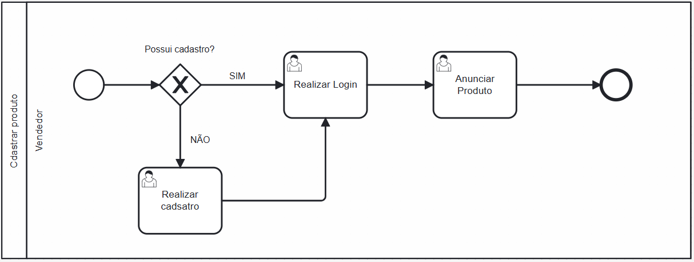

### 3.3.1 Processo 1 – Processo de Cadastro de Produtos 

O processo de **Cadastro de Produtos** está idealizado na forma descrita abaixo, no diagrama BPMN. Este processo exemplifica o cadastro de um produto na plataforma **Trocaki** por parte de um vendedor e suas etapas.

#### Detalhamento das atividades

**Vendedor**:
   - Caso não possua cadastro ele é realizado.
   - Realiza login na plataforma após o cadastro ou ao entrar no site.
   - Anuncia produto na plataforma, com as descrições e especificações.

**Nome da atividade 1**

| **Campo**       | **Tipo**         | **Restrições** | **Valor default** |
| ---             | ---              | ---            | ---               |
| [Nome do campo] | [tipo de dados]  |                |                   |
| ***Exemplo:***  |                  |                |                   |
| login           | Caixa de Texto   | formato de e-mail |                |
| senha           | Caixa de Texto   | mínimo de 8 caracteres |           |

| **Comandos**         |  **Destino**                   | **Tipo** |
| ---                  | ---                            | ---               |
| [Nome do botão/link] | Atividade/processo de destino  | (default/cancel/  ) |
| ***Exemplo:***       |                                |                   |
| entrar               | Fim do Processo 1              | default           |
| cadastrar            | Início do proceso de cadastro  |                   |

**Nome da atividade 2**

| **Campo**       | **Tipo**         | **Restrições** | **Valor default** |
| ---             | ---              | ---            | ---               |
| [Nome do campo] | [tipo de dados]  |                |                   |
|                 |                  |                |                   |

| **Comandos**         |  **Destino**                   | **Tipo**          |
| ---                  | ---                            | ---               |
| [Nome do botão/link] | Atividade/processo de destino  | (default/cancel/  ) |
|                      |                                |                   |
