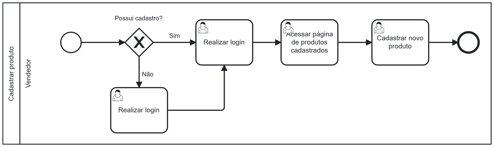

### 3.3.1 Processo 1 – Processo de Cadastro de Produtos 

O processo de **Cadastro de Produtos** está idealizado na forma descrita abaixo, no diagrama BPMN. Este processo exemplifica o cadastro de um produto na plataforma **Trocaki** por parte de um vendedor e suas etapas.

#### Detalhamento das atividades

**Vendedor**:
   - Caso não possua cadastro ele é realizado.
   - Realiza login na plataforma após o cadastro ou ao entrar no site.
   - Anuncia produto na plataforma, com as descrições e especificações.

**Realizar Cadastro**

| **Campo**       | **Tipo**         | **Restrições** | **Valor default** |
| ---             | ---              | ---            | ---               |
| Nome            | string           |Obrigatório     |                   |
| E-mail          | Caixa de Texto   |Formato de Email|                   |
| senha           | Caixa de Texto   |mínimo de 8 caracteres |            |

| **Comandos**         |  **Destino**                   | **Tipo** |
| ---                  | ---                            | ---               |
| cadastrar            | Início do proceso de cadastro  |                   |

**Realizar Login**

| **Campo**       | **Tipo**         | **Restrições** | **Valor default** |
| ---             | ---              | ---            | ---               |
| Email           | Caixa de Texto   |Formato de Email |                  |
| Senha           | Caixa de Texto   |Mínimo de 8 caracteres |            |

| **Comandos**         |  **Destino**                   | **Tipo**          |
| ---                  | ---                            | ---               |
| Entrar               | Tela Inicial                   | (default/cancel/  ) |

**Anunciar Produto**

| **Campo**       | **Tipo**         | **Restrições** | **Valor default** |
| ---             | ---              | ---            | ---               |
| Nome do Produto | String           |Obrigatório     |                   |
| Preço           | Double           |Apenas Valores Positivos |          |
| Descrição       | Caixa de Texto   |Obrigatório     |              |    |

| **Comandos**         |  **Destino**                   | **Tipo**          |
| ---                  | ---                            | ---               |
| Publicar             | Página Inicial - Processo Finalizado | (default/cancel/  ) |
