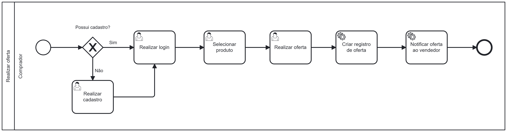

### 3.3.2 Processo 2 – Processo de realizar oferta

O **Processo de Compra de Eletrônicos usados** está atualmente idealizado assim, mas pode sofrer mudanças no decorrer do projeto. Nele é descrito como o comprador poderá mostrar interesse sobre um produto ao vendedor e também, sugerir um valor diferente.

#### Detalhamento das atividades

**Comprador**:
   - Caso não tenha cadastro, realiza o registro.
   - Se já tiver cadastro, faz login, seleciona o produto desejado e realiza uma oferta.

**Sistema**:
   - Recebe a oferta do comprador.
   - Notifica o vendedor sobre oferta.
   - Se aceita pelo vendedor, cria um pedido baseado na oferta e notifica o cliente.

**Vendedor**:
   - Envia o produto e fecha o pedido caso o pagamento seja confirmado .
   - Cancela o pedido se o pagamento não for realizado.

**Registro do Comprador**

| Campo          | Tipo              | Restrições                     | Valor default     |
|----------------|-------------------|--------------------------------|-------------------|
| nome           | Caixa de Texto    | mínimo de 3 caracteres         |                   |
| email          | Caixa de Texto    | formato de e-mail válido       |                   |
| senha          | Caixa de Texto    | mínimo de 8 caracteres         |                   |

| Comandos       | Destino                         | Tipo              |
|----------------|---------------------------------|-------------------|
| registrar      | Validação do registro           | default           |
| cancelar       | Retorna à página inicial         | cancel            |

**Atividade: Seleção do Item e Envio de Oferta**

| Campo           | Tipo              | Restrições                             | Valor default     |
|-----------------|-------------------|----------------------------------------|-------------------|
| nome do produto | string    | mínimo de 3 caracteres                 |                   |
| quantidade      | Caixa de Seleção  | apenas números positivos               | 1                 |
| valor da oferta | Caixa de Texto    | formato numérico com 2 casas decimais  |                   |

| Comandos        | Destino                         | Tipo              |
|-----------------|---------------------------------|-------------------|
| enviar         | Envia a proposta ao sistema     | default           |
| cancelar        | Retorna à página inicial        | cancel            |

