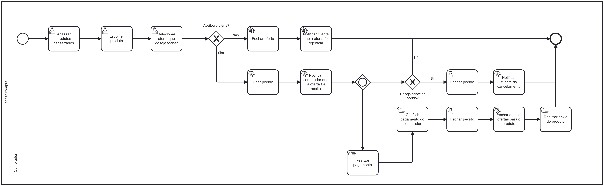

### 3.3.3 Processo 3 – Processo de fechar compra

O processo de **Fechar compra** está idealizado na forma descrita abaixo, no diagrama BPMN. Este processo exemplifica como um vendedor pode acessar as ofertas feitas para cada um de seus produtos. Além disso ele poderá rejeitar e aceitar uma oferta, e nesse último caso, fechar ou não a compra do produto solicitado.

#### Detalhamento das atividades
