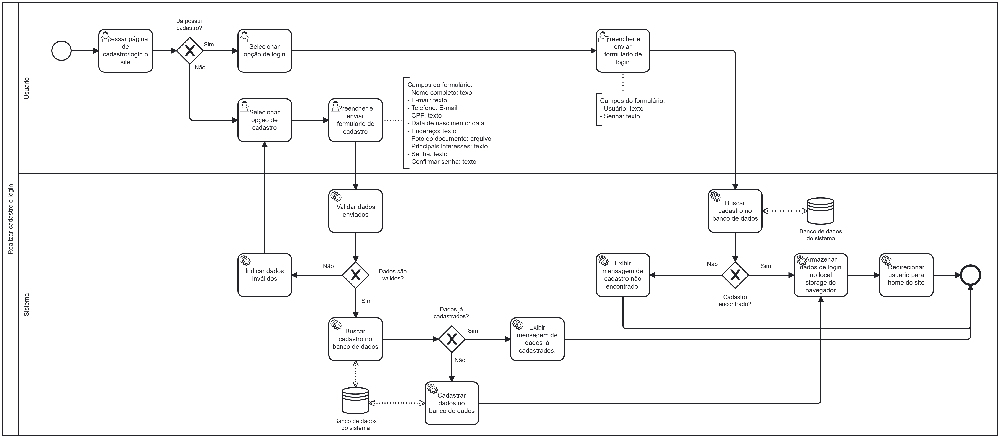

### 3.3.1 Processo 1 – Processo de Realizar cadastro e login

O processo modelado na imagem a seguir representa o fluxo de cadastro e login do usuário no sistema. Ele inicia quando o usuário acessa a página de cadastro/login do site e é questionado se já possui um cadastro.

Se o usuário já tiver cadastro, ele seleciona a opção de login e preenche o formulário correspondente, informando o nome de usuário e a senha. O sistema busca os dados no banco de dados e verifica se o cadastro existe. Se não for encontrado, exibe uma mensagem informando que o cadastro não foi localizado. Caso contrário, os dados de login são armazenados no local storage do navegador e o usuário é redirecionado para a página inicial do site.

Se o usuário não possuir cadastro, ele seleciona a opção de cadastro e preenche um formulário contendo diversos campos, como nome completo, e-mail, telefone, CPF, data de nascimento, endereço, foto do documento, interesses principais e senha. O sistema valida os dados enviados. Se houver algum erro, ele exibe uma mensagem indicando que os dados são inválidos. Caso contrário, sera buscado no banco de dados se o cadastro já existe. Se os dados já estiverem cadastrados, o sistema exibe uma mensagem informando que os dados já foram utilizados. Caso contrário, o sistema cadastra as informações no banco de dados, armazena as informações no localStorage e redireciona o usuário para a home page.

---

## **Usuário Envolvido**

### **Compradores e Vendedores**

O usuário é o indivíduo que ainda não possui cadastro na plataforma e deseja criar uma conta para utilizar os serviços disponíveis. Durante o processo de cadastro, ele informa seus dados pessoais, cria credenciais de acesso e concorda com os termos da plataforma. Após concluir o cadastro, o novo usuário pode realizar o login utilizando suas credenciais e acessar as funcionalidades disponibilizadas para usuários registrados.

---

## **Tarefas Detalhadas**

### **1. Acessar Home Page do Site**

| **Campo** | **Tipo** | **Restrições** | **Valor Default** |
|-----------|---------|---------------|------------------|
| Acessar URL do site | Ação | Navegador aberto | - |

| **Comando** | **Destino** | **Tipo** | 
|-----------|---------|---------------|
| Acessar login/cadastro | Página de login/cadastro | default |

---

### **3. Preencher e Enviar Formulário de Cadastro**

| **Campo** | **Tipo** | **Restrições** | **Valor Default** |
|-----------|---------|---------------|------------------|
| Nome completo	 | Texto | Obrigatório, 100 caracteres | - |
| E-mail | E-mail	 | Obrigatório, formato válido | - |
| Telefone | Texto | Obrigatório | - |
| CPF | Texto | Obrigatório | - |
| Data de nascimento | Data | Obrigatório | - |
| Senha | Texto | Obrigatório | - |
| Confirmar senha	 | Texto | Obrigatório, e igual ao campo "Senha" | - |

| **Comando** | **Destino** | **Tipo** | 
|-----------|---------|---------------|
| Enviar formulário	 | Validação de dados | default |
| Cancelar envio | Fim do processo | default |

---

### **4. Preencher e Enviar Formulário de Login**

| **Campo** | **Tipo** | **Restrições** | **Valor Default** |
|-----------|---------|---------------|------------------|
| Usuário (e-mail) | Texto | Obrigatório | - |
| Senha | Texto | Obrigatório | - |

| **Comando** | **Destino** | **Tipo** | 
|-----------|---------|---------------|
| Enviar formulário | Validação de login | default | 
| Cancelar envio | Fim do processo | cancel |

---

### **5. Validação**
**Cadastro**

| **Ação** | **Restrições** |
|-----------|---------|
| Validar dados do formulário | Todos os campos obrigatórios preenchidos e corretos |
| Verificar cadastro existente | E-mail já cadastrado |

**Login**

| **Ação** | **Restrições** |
|-----------|---------|
| Validar dados de login | Usuário e senha corretos no banco de dados |

---
