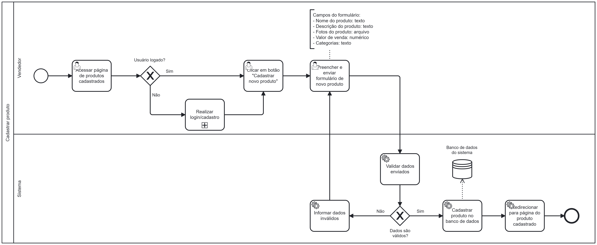

### 3.3.2 Processo 2 – Processo de Cadastro de Produtos 

O processo modelado na imagem a seguir representa o fluxo de cadastro de produtos. Ele inicia com a verificação se o usuário está logado. Se não estiver, ele deve realizar o login antes de prosseguir. Caso já esteja autenticado, ele acessa a página de produtos cadastrados e seleciona a opção de cadastrar um novo produto.

O usuário preenche um formulário com informações como nome, descrição, fotos, valor de venda e categoria do produto. Após o envio, o sistema valida os dados. Se houver erros, o usuário é informado para corrigir as informações. Caso os dados estejam corretos, o produto é cadastrado no banco de dados.

Por fim, o usuário é redirecionado para a página do produto cadastrado, encerrando o processo.

---

## **Usuário Envolvido**

### **Vendedor**
O vendedor é o usuário responsável por cadastrar novos produtos na plataforma. Ele deve estar previamente cadastrado e logado no sistema. Após o login, ele pode acessar a lista de produtos já cadastrados e inserir um novo produto com suas respectivas informações.

---

## **Tarefas Detalhadas**

### **1. Verificação de Cadastro**
- **Descrição**: O sistema pergunta se o usuário já possui cadastro.
- **Tipo**: Decisão lógica (gate exclusivo)
- **Condições**:  
  - **Sim** → Redireciona para "Realizar login"  
  - **Não** → Redireciona para "Realizar cadastro"  

---

### **2. Realizar Cadastro**

| **Campo** | **Tipo** | **Restrições** | **Valor Default** |
|-----------|---------|---------------|------------------|
| Nome | String | Obrigatório | - |
| E-mail | Caixa de texto | Formato de e-mail válido | - |
| Senha | Caixa de texto | Mínimo de 8 caracteres | - |

| **Comandos** | **Destino** | **Tipo** |
|-------------|------------|---------|
| Cadastrar | Início do processo de login | - |

---

### **3. Realizar Login**

| **Campo** | **Tipo** | **Restrições** | **Valor Default** |
|-----------|---------|---------------|------------------|
| E-mail | Caixa de texto | Formato de e-mail válido | - |
| Senha | Caixa de texto | Mínimo de 8 caracteres | - |

| **Comandos** | **Destino** | **Tipo** |
|-------------|------------|---------|
| Entrar | Tela Inicial | default/cancel |

---

### **4. Acessar Página de Produtos Cadastrados**
- **Descrição**: Após o login, o vendedor acessa a área onde estão listados os produtos cadastrados.
- **Campos**: Não há campos de entrada.

| **Comandos** | **Destino** | **Tipo** |
|-------------|------------|---------|
| Acessar | Tela de Cadastro de Produto | default |

---

### **5. Cadastrar Novo Produto**

| **Campo** | **Tipo** | **Restrições** | **Valor Default** |
|----------------|---------|--------------------|------------------|
| Nome do Produto | String | Obrigatório | - |
| Preço | Double | Apenas valores positivos | - |
| Descrição | Caixa de texto | Obrigatório | - |

| **Comandos** | **Destino** | **Tipo** |
|-------------|------------------------------|---------|
| Publicar | Página Inicial - Processo Finalizado | default/cancel |
