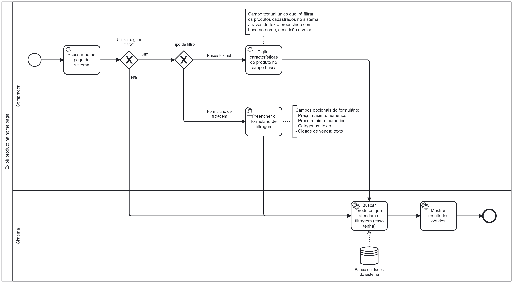

### 3.3.3 Processo 3 – Processo de Exibir produto na home page

O processo modelado na imagem a seguir representa o fluxo de exibição de produtos na home page. Ele inicia quando o comprador acessa a página inicial do sistema. Em seguida, ele decide se deseja utilizar algum filtro para buscar produtos. Se optar por não filtrar, o sistema busca todos os produtos cadastrados no banco de dados e os exibe ao usuário.

Caso o comprador escolha utilizar filtros, ele pode optar por uma busca textual, digitando características do produto no campo de pesquisa, ou preencher um formulário de filtragem com critérios opcionais, como preço máximo, preço mínimo, categoria e cidade de venda.

Com base nos critérios definidos pelo comprador, o sistema consulta o banco de dados para encontrar os produtos que atendam à filtragem selecionada. Por fim, os resultados obtidos são apresentados ao comprador, encerrando o processo.

---

## **Usuário Envolvido**

### **Usuário**
Descricao

---

## **Tarefas Detalhadas**

### **1. Tarefa**
- **Descrição**: O sistema pergunta se o usuário já possui cadastro.
- **Tipo**: Decisão lógica (gate exclusivo)
- **Condições**:  
  - **Sim** → Redireciona para "Realizar login"  
  - **Não** → Redireciona para "Realizar cadastro"  

---
