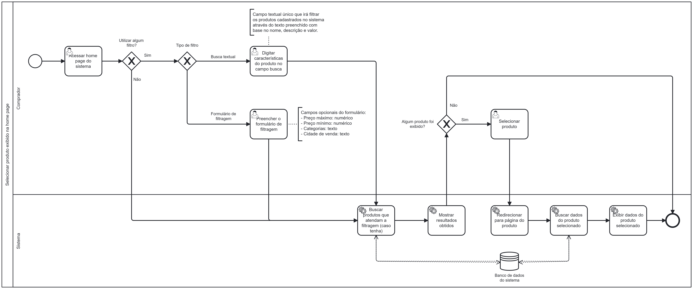

### 3.3.3 Processo 3 – Processo de Selecionar produto exibido na home page

O processo modelado na imagem a seguir representa o fluxo de exibição de produtos na home page. Ele inicia quando o comprador acessa a página inicial do sistema. Em seguida, ele decide se deseja utilizar algum filtro para buscar produtos. 

Se optar por não filtrar, o sistema busca todos os produtos cadastrados no banco de dados e os exibe ao usuário. 

Caso o comprador escolha utilizar filtros, ele pode optar por uma busca textual, digitando características do produto no campo de pesquisa, ou preencher um formulário de filtragem com critérios opcionais, como preço máximo, preço mínimo, categoria e cidade registrada do produto. Com base nos critérios definidos pelo comprador, o sistema consulta o banco de dados para encontrar os produtos correspondentes da filtragem selecionada. 

Por fim, os resultados obtidos são apresentados ao comprador caso existam. Em caso positivo, o comprador selecionar o produto que deseja e em seguida o sistema o redireciona para a página do produto, busca suas informações no banco de dados e as exibe na tela para o usuário.

---

## **Usuário Envolvido**

### **Comprador**
O comprador é responsável por intergir diretamente com o sistema de busca e seleção de produtos. Suas funções no processo incluem acessar a página inicial do sistema, decidir se deseja utilizar filtros de busca e, em caso afirmativo, escolher entre realizar uma busca textual com descrição do produto ou preencher um formulário de filtragem com critérios como preço, categoria e cidade.

---

## **Tarefas Detalhadas**

### **1. Acessar home page do sistema**

| **Comandos**         |  **Destino**                   | **Tipo** |
| ---                  | ---                            | ---               |
| Acessar home page do sistema | Selecionar produto | default           |

| **Campo** |  **Tipo** | **Restrições** | **Valor Default** |
| ---    | ---  | --- | --- |
| Filtro | Caixa de seleção | "Sim" ou "Não" | Não |
| Tipo de filtro | Caixa de seleção | "Busca textual" ou "Formulário de filtragem" | -- |
| Filtro Busca textual | Caixa de texto | Texto livre | -- |
| Filtro Formulário de filtragem | Caixa de texto | Preço máximo e mínimo: Numérico / Categorias e Cidade de venda: Texto | -- |

---

  **2. Selecionar Produto**

| **Comandos**         |  **Destino**                   | **Tipo** |
| ---                  | ---                            | ---               |
| Selecionar Produto | Fim do processo | default           |
