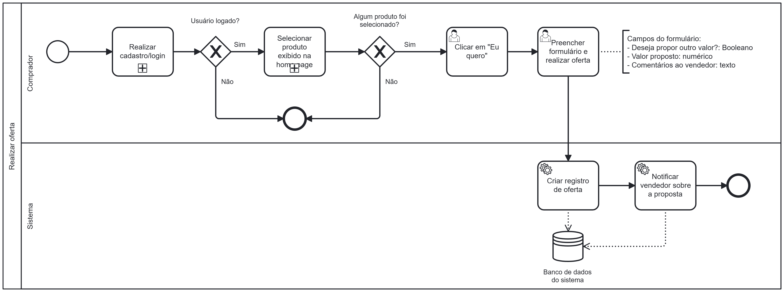

### 3.3.4 Processo 4 – Processo de Realizar Oferta

O processo modelado na imagem a seguir representa o fluxo de realização de uma oferta pelo comprador. Ele inicia quando o comprador acessa o sistema e realiza login ou cadastro. Se o usuário não estiver logado, o fluxo é interrompido. Caso esteja, a página inicial do sistema exibe os produtos disponíveis.

O comprador seleciona um produto de interesse e clica no botão "Eu quero". Em seguida, preenche um formulário de oferta, podendo indicar se deseja propor outro valor, informar o valor sugerido e adicionar comentários ao vendedor.

Após o envio, o sistema registra a oferta no banco de dados e notifica o vendedor sobre a proposta recebida.

---

## **Usuários Envolvidos**

### **Comprador**
O comprador é o usuário responsável por realizar ofertas em produtos disponíveis na plataforma. Caso não possua cadastro, ele deve realizá-lo antes de efetuar uma oferta. Uma vez logado, o comprador pode navegar pelos produtos, selecionar um item de interesse e enviar uma proposta ao vendedor.

### **Sistema**
O sistema recebe a oferta do comprador e a encaminha ao vendedor, registrando a transação e notificando ambas as partes.

### **Vendedor**
O vendedor recebe a notificação da oferta e pode aceitá-la ou recusá-la. Caso aceite, um pedido é gerado e o comprador é notificado.

---

## **Tarefas Detalhadas**

### **1. Verificação de Cadastro**
- **Descrição**: O sistema verifica se o comprador já possui cadastro.
- **Tipo**: Decisão lógica (gate exclusivo)
- **Condições**:  
  - **Sim** → Redireciona para "Realizar login"  
  - **Não** → Redireciona para "Realizar cadastro"  

---

### **2. Realizar Cadastro**

| **Campo** | **Tipo** | **Restrições** | **Valor Default** |
|-----------|---------|---------------|------------------|
| Nome | Caixa de Texto | Mínimo de 3 caracteres | - |
| E-mail | Caixa de Texto | Formato de e-mail válido | - |
| Senha | Caixa de Texto | Mínimo de 8 caracteres | - |

| **Comandos** | **Destino** | **Tipo** |
|-------------|------------|---------|
| Registrar | Validação do Registro | default |
| Cancelar | Retorna à Página Inicial | cancel |

---

### **3. Realizar Login**

| **Campo** | **Tipo** | **Restrições** | **Valor Default** |
|-----------|---------|---------------|------------------|
| E-mail | Caixa de Texto | Formato de e-mail válido | - |
| Senha | Caixa de Texto | Mínimo de 8 caracteres | - |

| **Comandos** | **Destino** | **Tipo** |
|-------------|------------|---------|
| Entrar | Tela Inicial | default/cancel |

---

### **4. Selecionar Produto e Enviar Oferta**
- **Descrição**: Após o login, o comprador pode visualizar a lista de produtos e selecionar aquele que deseja fazer uma oferta.

| **Campo** | **Tipo** | **Restrições** | **Valor Default** |
|----------------|---------|--------------------|------------------|
| Nome do Produto | String | Mínimo de 3 caracteres | - |
| Quantidade | Caixa de Seleção | Apenas números positivos | 1 |
| Valor da Oferta | Caixa de Texto | Formato numérico com 2 casas decimais | - |

| **Comandos** | **Destino** | **Tipo** |
|-------------|------------------------|---------|
| Enviar | Envia a Proposta ao Sistema | default |
| Cancelar | Retorna à Página Inicial | cancel |

---

### **5. Criar Registro de Oferta e Notificar Vendedor**
- **Descrição**: O sistema recebe a oferta, registra a transação e envia uma notificação ao vendedor.
- **Campos**: Não há campos de entrada.

| **Comandos** | **Destino** | **Tipo** |
|-------------|---------------------|---------|
| Notificar | Envia notificação ao vendedor | automático |

---

### **6. Decisão do Vendedor**
- **Descrição**: O vendedor recebe a notificação e pode aceitar ou recusar a oferta.

| **Opção** | **Ação** |
|----------|--------|
| Aceitar | Gera um pedido e notifica o comprador |
| Recusar | Cancela a oferta |

---

### **7. Conclusão do Pedido**
- **Descrição**: Caso o vendedor aceite a oferta e o pagamento seja confirmado, o pedido é finalizado.
- **Condições**:
  - **Pagamento confirmado** → Envio do produto e fechamento do pedido.
  - **Pagamento não realizado** → Cancelamento do pedido.

---

