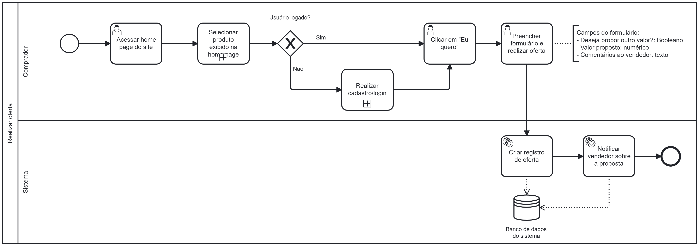

### 3.3.4 Processo 4 – Processo de Realizar Oferta

O processo modelado na imagem a seguir representa o fluxo de realização de uma oferta pelo comprador. Ele inicia quando o comprador acessa o sistema e realiza login ou cadastro. Se o usuário não estiver logado, o fluxo é interrompido. Caso esteja, o usuário deve selecionar algum produto que tenha sido exibido na home page. Caso isso não ocorra, o processo é encerrado.

Após selecionar um produto, o comprador clica no botão "Eu quero". Em seguida, preenche um formulário de oferta, podendo indicar se deseja propor outro valor ou aceitar o valor sugerido, além da opção de adicionar comentários ao vendedor.

Após o envio, o sistema registra a oferta no banco de dados e notifica o vendedor sobre a proposta recebida.

---

## **Usuário Envolvido**

### **Comprador**
O comprador é o usuário responsável por realizar ofertas em produtos disponíveis na plataforma. Caso não possua cadastro, ele deve realizá-lo antes de efetuar uma oferta. Uma vez logado, o comprador pode navegar pelos produtos, selecionar um item de interesse e enviar uma proposta ao vendedor.

---

## **Tarefas Detalhadas**

### **1. Acessar Home Page do Site**

| **Campo** | **Tipo** | **Restrições** | **Valor Default** |
|-----------|---------|---------------|------------------|
| Acessar URL do site | Ação | Navegador aberto | - |

| **Comando** | **Destino** | **Tipo** | 
|-----------|---------|---------------|
| Acessar site | Página inicial do sistema | default |

---

### **2. Clicar em "Eu quero"**

| **Campo** | **Tipo** | **Restrições** | **Valor Default** |
|-----------|---------|---------------|------------------|
| Botão "Eu Quero" | Botão de ação | Usuário logado | - |

| **Comandos** | **Destino** | **Tipo** |
|-------------|------------|---------|
| Clicar em "Eu Quero" | Abrir formulário de oferta | default |

---

### **3. Preencher Formulário e Realizar Oferta**

| **Campo** | **Tipo** | **Restrições** | **Valor Default** |
|-----------|---------|---------------|------------------|
| Deseja propor outro valor? | Booleano (Sim/Não) | Obrigatório | Não |
| Valor Proposto | Numérico | Obrigatório se "Sim" | - |
| Comentários ao vendedor | Texto livre | Opcional | - |

| **Comandos** | **Destino** | **Tipo** |
|-------------|------------|---------|
| Enviar formulário | Criar registro de oferta | default |
| Cancelar envio | Fim do processo | cancel |

---

