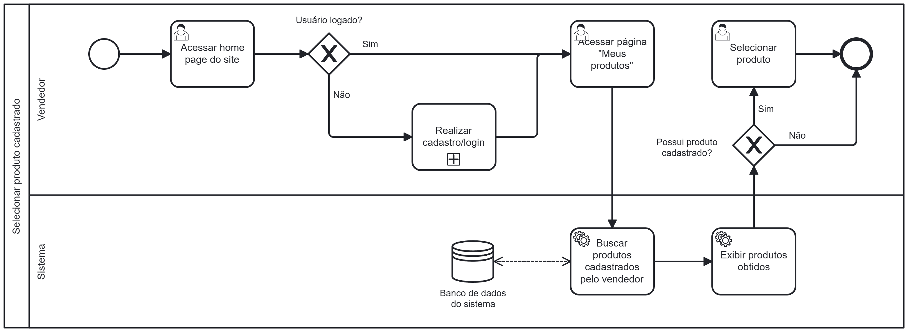

### 3.3.5 Processo 5 – Processo de Selecionar produtos cadastrados

O processo modelado na imagem a seguir representa o fluxo de selecionar um produto cadastrado anteriormente pelo próprio usuário. Ele inicia quando um vendedor realiza o cadastro ou login na plataforma. Após isso, o sistema verifica se o usuário está logado e, em caso negativo, o fluxo se encerra. Se o usuário estiver logado, ele deve se direcionar para a página "Meus produtos".

Feito isso, o sistema busca no banco de dados os produtos cadastrados pelo vendedor e exibe na tela o resultado obtido. Se o vendedor não possuir produtos cadastrados, o fluxo se encerra. Se o vendedor possuir produtos cadastrados, ele deve selecionar um deles.

---

## **Usuário Envolvido**

### **Usuário**
Descricao

---

## **Tarefas Detalhadas**

### **1. Tarefa**
- **Descrição**: O sistema pergunta se o usuário já possui cadastro.
- **Tipo**: Decisão lógica (gate exclusivo)
- **Condições**:  
  - **Sim** → Redireciona para "Realizar login"  
  - **Não** → Redireciona para "Realizar cadastro"  

---
