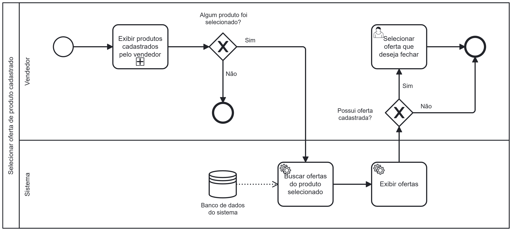

### 3.3.6 Processo 6 – Processo de Selecionar oferta de produto cadastrado

O processo modelado na imagem a seguir representa o fluxo de seleção de uma oferta feita a um produto do vendedor. Ele inicia quando esse vendedor seleciona um de seus produtos cadastrados. Feito isso, o sistema busca no banco de dados as ofertas feitas a esse produto e exibe na tela o resultado.

Caso exista alguma oferta, o vendedor deve selecionar alguma delas. Caso não exista, nada deverá ser feito.

---

## **Usuário Envolvido**

### **Usuário**
Descricao

---

## **Tarefas Detalhadas**

**1. Selecionar oferta que deseja fechar**

| **Campo** | **Tipo** | **Restrições** | **Valor default** |
| ---                  | ---                            | ---               | ---               |
| Oferta | Link  |  |  |

| **Comandos**         |  **Destino**                   | **Tipo**          |
| ---                  | ---                            | ---               |
| Selecionar oferta | Fim do processo | default |
