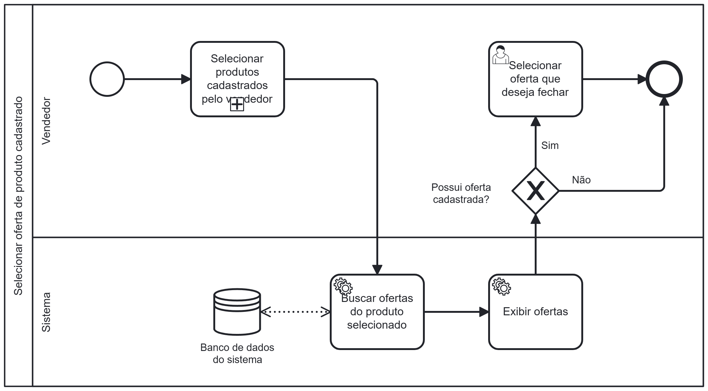

### 3.3.6 Processo 6 – Processo de Selecionar oferta de produto cadastrado

Descrição: 

---

## **Usuário Envolvido**

### **Usuário**
Descricao

---

## **Tarefas Detalhadas**

### **1. Tarefa**
- **Descrição**: O sistema pergunta se o usuário já possui cadastro.
- **Tipo**: Decisão lógica (gate exclusivo)
- **Condições**:  
  - **Sim** → Redireciona para "Realizar login"  
  - **Não** → Redireciona para "Realizar cadastro"  

---
