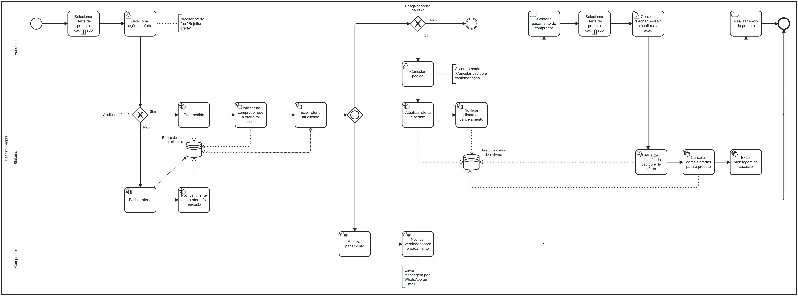

### 3.3.7 Processo 7 – Processo de Fechar compra

O processo modelado na imagem a seguir representa o fluxo de fechar uma oferta feita a um produto cadastrado pelo vendedor. Ele inicia quando o vendedor seleciona uma oferta recebida para de seus produto cadastrados. Caso não selecione, o fluxo é encerrado. 

Se uma oferta for escolhida, ele pode optar por aceitá-la ou rejeitá-la. Se a oferta for rejeitada, o sistema fecha a oferta e notifica o comprador. Se a oferta for aceita, o sistema cria um pedido, registra essa ação no banco de dados e notifica o comprador sobre a aceitação. Em seguida, a oferta atualizada é exibida.

O comprador então realiza o pagamento fora da plataforma e depois entra em contato com o vendedor informando isso, também fora da plataforma. O vendedor então confere o pagamento fora da plataforma, depois busca e seleciona a oferta em questão. Feito isso, ele finaliza o pedido dessa oferta e confirma a ação ao clicar em "Fechar pedido". O sistema atualiza o status do pedido e da oferta, cancela as demais ofertas para o produto e exibe uma mensagem de sucesso.

Se o vendedor decidir cancelar o pedido antes que o comprador informe o pagamento, ele deve acessar a proposta cadastrada e clicar no botão de cancelamento, confirmando a ação. O sistema atualiza o status do pedido e notifica o cliente sobre o cancelamento.

---

## **Usuário Envolvido**

### **Vendedor**
O vendedor é responsável por gerenciar as ofertas dos produtos cadastrados e conduzir o processo de fechamento de compra. O vendedor inicia selecionando uma oferta e decidindo se deseja aceitar ou recusar ela. Caso aceite, ele acompanha a criação do pedido e aguarda pagamento do comprador, podendo cancelar o pedido a qualquer momento antes do pagamento. Caso rejeite, a oferta é finalizada e o comprador notificado.

---

## **Tarefas Detalhadas**

**1. Selecionar ação na oferta**

| **Campo** |  **Tipo**       | **Restrições** | **Valor Default** |
| ---    | ---  | ---      | --- |
| Selecionar ação na oferta | Caixa de seleção   | "Aceitar oferta" ou "Recusar oferta" | - |

| **Comandos**         |  **Destino**                   | **Tipo** |
| ---                  | ---                            | ---               |
| Aceitar oferta | Criar pedido | default           |
| Recusar oferta | Fim do processo | default           |
---

**2. Criar pedido**

| **Campo** |  **Tipo**       | **Restrições** | **Valor Default** |
| ---    | ---  | ---      | --- |
| Cancelar pedido | Botão de ação| Confirmação obrigatória | - |

| **Comandos**         |  **Destino**                   | **Tipo** |
| ---                  | ---                            | ---               |
| Criar pedido | Conferir pagamento do comprador | default           |
| Cancelar pedido | Fim do processo | default           |

---
**3. Conferir pagamento do comprador**

| **Comandos**         |  **Destino**                   | **Tipo** |
| ---                  | ---                            | ---               |
| Conferir pagamento do comprador | fechar pedido | default           |

---

**4. Fechar pedido**

| **Comandos**         |  **Destino**                   | **Tipo** |
| ---                  | ---                            | ---               |
| Fechar pedido | Fim do processo | default           |

