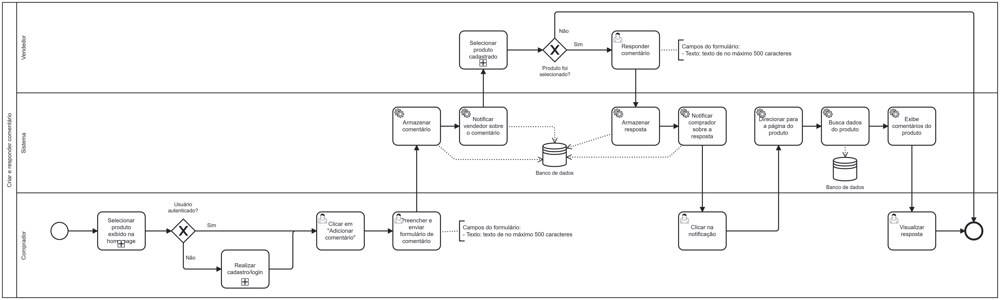

### 3.3.8 Processo 8 – Processo de Criar e responder comentário

O processo modelado na imagem a seguir representa o fluxo de criação e resposta de um comentário na plataforma. Ele inicia com o comprador realizando o cadastro ou login no sistema através da página de log-in/cadastro. Após isso, caso ele não esteja autenticado, o processo se encerra. Caso contrário, o comprador seleciona um produto exibido na home page da plataforma. Caso nenhum produto seja selecionado, o processo também se encerra.

Após a seleção, o comprador clica na opção "Criar comentário", preenche o formulário de comentário com o texto desejado e em seguida clicar em "Enviar". O sistema, então, cadastra esse comentário no banco de dados e em seguida envia uma notificação para o vendedor, informando sobre o novo comentário. A notificação também é armazenada no banco de dados.

O vendedor, por sua vez, busca e seleciona o produto que recebeu o comentário através da página "Meus produtos". Se algum produto for selecionado, ele clica em "Responder" e preenche o formulário de resposta ao comentário com o texto desejado. O sistema, então, cadastra essa resposta no banco de dados e notifica o comprador sobre a resposta do vendedor. A notificação também é armazenada no banco de dados.

O comprador então clica na notificação e em seguida o sistema redireciona a página para o produto em questão. Após isso, os sitema busca os dados desse produto no banco de dados e os exibe na tela para o cliente, juntamente com o comentário e a resposta. Em seguida, o comprador visualiza a resposta exibida.

---

## **Usuário Envolvido**

### **Comprador**
Usuário responsável por selecionar produtos, comentar e visualizar respostas.

### **Vendedor**
Usuário responsável por responder comentários deixados em seus produtos.

---

## **Tarefas Detalhadas**

### **Atividade: Realizar cadastro/login (Comprador)**

#### Campos

| Campo  | Tipo           | Restrições              | Valor default |
|--------|----------------|--------------------------|----------------|
| login  | Caixa de Texto | formato de e-mail        | —              |
| senha  | Caixa de Texto | mínimo de 8 caracteres   | —              |

#### Comandos

| Comando   | Destino                        | Tipo    |
|-----------|--------------------------------|---------|
| entrar    | Fim do Processo 1              | default |
| cadastrar | Início do processo de cadastro | default |

---

### **Atividade: Selecionar produto exibido na homepage (Comprador)**

#### Campos

| Campo      | Tipo    | Restrições   | Valor default |
|------------|---------|--------------|----------------|
| produto_id | Seleção | obrigatório  | —              |

#### Comandos

| Comando    | Destino                        | Tipo    |
|------------|--------------------------------|---------|
| selecionar | Verificação de autenticação    | default |

---

### **Atividade: Clicar em "Adicionar comentário" (Comprador)**

#### Campos

| Campo | Tipo | Restrições | Valor default |
|-------|------|------------|----------------|
| —     | —    | —          | —              |

#### Comandos

| Comando              | Destino                          | Tipo    |
|----------------------|----------------------------------|---------|
| adicionar comentário | Exibição do formulário de comentário | default |

---

### **Atividade: Preencher e enviar formulário de comentário (Comprador)**

#### Campos

| Campo      | Tipo           | Restrições                       | Valor default |
|------------|----------------|----------------------------------|----------------|
| comentário | Caixa de Texto | texto de no máximo 500 caracteres | —              |

#### Comandos

| Comando | Destino             | Tipo    |
|---------|---------------------|---------|
| enviar  | Armazenar comentário | default |

---

### **Atividade: Selecionar produto cadastrado (Vendedor)**

#### Campos

| Campo      | Tipo    | Restrições  | Valor default |
|------------|---------|-------------|----------------|
| produto_id | Seleção | obrigatório | —              |

#### Comandos

| Comando    | Destino                            | Tipo    |
|------------|-------------------------------------|---------|
| selecionar | Exibir botão "Responder comentário" | default |

---

### **Atividade: Responder comentário (Vendedor)**

#### Campos

| Campo    | Tipo           | Restrições                       | Valor default |
|----------|----------------|----------------------------------|----------------|
| resposta | Caixa de Texto | texto de no máximo 500 caracteres | —              |

#### Comandos

| Comando | Destino            | Tipo    |
|---------|--------------------|---------|
| enviar  | Armazenar resposta | default |

---

### **Atividade: Clicar na notificação (Comprador)**

#### Campos

| Campo | Tipo | Restrições | Valor default |
|-------|------|------------|----------------|
| —     | —    | —          | —              |

#### Comandos

| Comando     | Destino                          | Tipo    |
|-------------|----------------------------------|---------|
| visualizar  | Direcionar para página do produto | default |

---

### **Atividade: Visualizar resposta (Comprador)**

#### Campos

| Campo | Tipo | Restrições | Valor default |
|-------|------|------------|----------------|
| —     | —    | —          | —              |

#### Comandos

| Comando | Destino | Tipo    |
|---------|---------|---------|
| —       | Fim     | default |
