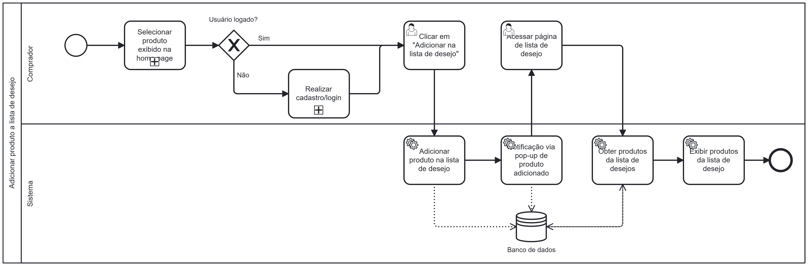

### 3.3.9 Processo 9 – Processo de Adicionar produto na lista de compra

O processo modelado na imagem a seguir representa o fluxo de adição de um produto na lista de desejo do comprador. Ele inicia com a página de cadastro/login, depois verificando se o usuário está logado, e, em caso negativo, o fluxo é encerrado.

Se o usuário estiver logado, ele deve escolher algum produto exibido na home page e caso isso não seja feito, o processo também se encerra. Após selecionar um produto, ele deve clicar na opção "Adicionar na lista de desejo".

O sistema, então, atualiza a lista de desejos do comprador no banco de dados e envia uma notificação para ele, através de um pop-up, informando que o produto foi adicionado à lista de desejos. Após isso, o comprador consegue acessar a página de lista de desejo onde o sistema irá buscar no banco de dados os produtos que estão na lista dele e exibí-los na tela.

---

## **Usuário Envolvido**

### **Usuário**
Descricao

---

## **Tarefas Detalhadas**

### **1. Tarefa**
- **Descrição**: O sistema pergunta se o usuário já possui cadastro.
- **Tipo**: Decisão lógica (gate exclusivo)
- **Condições**:  
  - **Sim** → Redireciona para "Realizar login"  
  - **Não** → Redireciona para "Realizar cadastro"  

---
